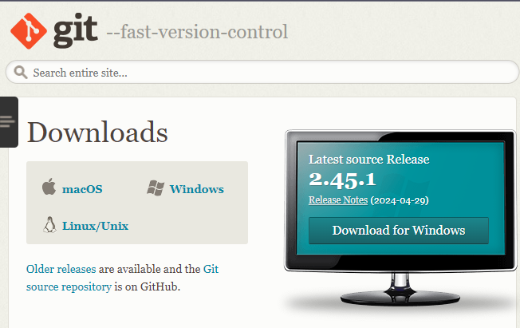
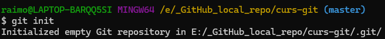
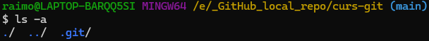
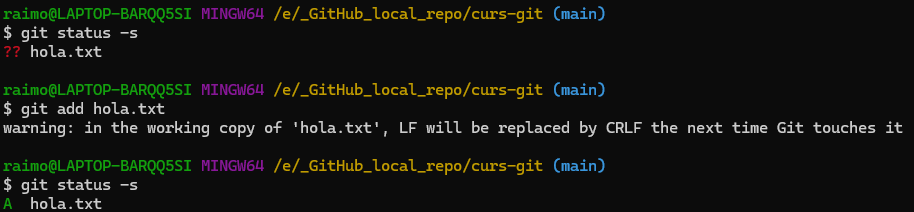
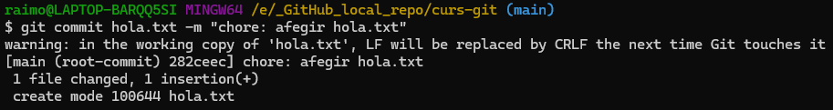
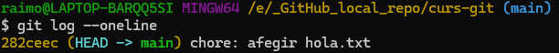
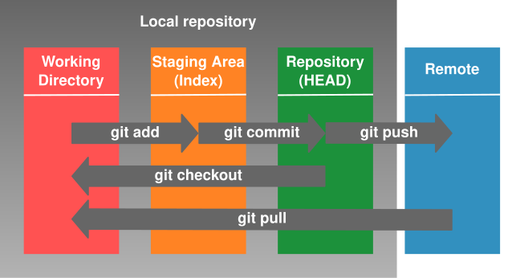

# Instal·lar Git
Git no deixa de ser un programa que podem instal·lar al nostre ordinador local igual que qualsevol altre.

Existeix la versió de Git per a múltiples Sistemes Operatius: Windows, Mac, Linux, etc. Podem descarregar la versió que necessitem aquí: https://git-scm.com/downloads



El procés d'instal·lació és senzill.
# Iniciar repositori de Git
Tot i que ja fa temps que **existeixen clients amb interfície gràfica** **per a usar Git**, és important que en coneguem les comades bàsiques ja que ens ajudarà després a entendre millor quines accions es porten a terme quan ho integrem en un IDE tal com **IntellIJ** o **Visual Studio Code**.

> [!NOTE]
> Un **IDE** és un programa amb entorn gràfic pensat per al desenvolupament de software.

Per a aquesta primera part del curs, usarem un **terminal del sistema operatiu**.

Per a iniciar un terminal podem fer: 
- **Ubuntu Linux** usant la combinació <kbd>Control</kbd> + <kbd>Alt</kbd>+ <kbd>t</kbd>
- **Windows** usant la combinació <kbd>Windows</kbd> + <kbd>r</kbd>
- **MacOs** usant <kbd>Command</kbd> + <kbd>Espai</kbd> per a obrir les dreceres i allà escribim *"terminal"*

Un cop dins del terminal, navegarem fins a dins de la carpeta on volem iniciar el repositori. La carpeta pot estar buida o plena prèviament.

> [!IMPORTANT]
> Per a iniciar un repositori de Git usarem:
> ```bash
> git init
> ```

**Exemple:**


Aquesta comanda `git init` crearà un conjunt de fitxers i carpetes ocultes que usarà per a fer el control del versionat del contingut de la carpeta i només l'usarem una vegada.

Git crea unes àrees de treball:
1. Àrea de treball: *working directory*
2. Àrea d'assaig: *staging area*
3. Àrea confirmada del repositori local: *commit area*

Aquesta feina no es fa per art de màgia, si no que Git ho guardarà tot dins de la carpeta oculta `.git` que crea al iniciar el repositori:

## Working area
El *working area* o *working directory* no és més que tot el contingut d'arxius i subcarpetes que tenim a dins de la carpeta del repositori.

Si com a usuari de Git no hem especificat el contrari, d'inici no es fa seguiment de cap dels arxius o carpetes que hi hagi dins del *working directory*.

Per tal de que es faci seguiment dels canvis d'un arxiu o carpeta, els hem de passar del *working directory* al *staging area*.

> [!IMPORTANT] 
> Per a passar un arxiu del *working directory* al *staging area* usarem:
> ```bash
> git add arxiu (o carpeta)
> ```
> 
> També podem enviar massivament tots els canvis i tots els arxius nous a la *staging area* usant el **punt**:
> ```bash
> git add .
> ```

Aquesta acció no mou el fitxer físicament de lloc dins del disc dur ni el perdrem de vista. A nivell d'usuari de l'ordinador no percebrem cap canvi amb aquest arxiu.

**Exemple:**

## Staging area
Aquesta àrea està destinada a contenir arxius i carpetes etiquetades per a fer-ne seguiment del control de versions.

Se li diu zona de proves ja que serveix de pas previ a fer una *captura* de l'estat actual del codi dels arxius que li posem a dins.

> [!TIP] 
> Com veurem més endavant quan integrem Git dins d'un IDE, sovint aquests se salten el pas de la *zona de staging* i salten directament a la *commit area*.

> [!IMPORTANT]
> Per a passar els arxius de la *staging area* cap a la *commit area*, especificarem l'arxiu o directori que volem confirmar i especificarem un comentari explicant els canvis fets usant el **paràmetre obligatori m**:
>```bash
>git commit -m "comentari del commit"
>```
>Existeixen múltiples variants en l'ús de l'operador **commit** però possiblement el més ortodox és l'esmentat anteriorment ja que es limita a confirmar exclusiva i estrictament els canvis que hi hagi a dins de la staging area.
>
>Tot i que en molta documentació no ho recomanen, per a confirmar els canvis pendents de confirmar de tots els arxius i carpetes que hi ha actualment a la staging area, podem usar el **punt**:
>```bash
>git commit .
>```

**Exemple:**




## Repositori local
La *commit area* o repositori local conté la **versió confirmada** més actual dels arxius i carpetes del **repositori local** dels quals se n'està fent control de versions així com tot l'històric dels canvis que han sofert.

> [!TIP]
> També se l'anomena **zona confirmada** ja que conceptualment conté l'última versió confirmada de cada arxiu o carpeta. Entenem com a confirmats aquells arxius de codi que s'han testejat i que sabem que funcionen correctament.

Cada vegada que fem un `git commit` es crearà una versió nova del repositori amb l'estat actual dels arxius i carpetes que es troben a la *staging area* en aquell moment i també tots els arxius i carpetes que s'han quedat igual que en la versió anterior sense cap modificació nova i que, per tant, no han passat per la *staging area* en aquesta ocasió.

>[!TIP]
>En els casos en què volguem afegir un canvi a la *staging area* i confirmar-lo seguidament, podem usar la comanda:
>```bash
>git commit -am "comentari del comit"
>```
>Aquesta acció executarà `git add` + `git commit`

>[!TIP]
>Si ens hem equivocat al escriure el missatge de l'últim commit, el podem corregir usant:
>```bash
>git commit --amend
>```
>Aquesta comanda ens obrirà l'editor per defecte que hi hagi configurat en el nostre sistema operatiu *(vim per defecte)* i ens permetrà editar el comentari de l'últim commit.

# Git lifecycle workflow diagram
A continuació podem veure un (dels milions) de diagrames del cicle de vida o fluxe de treball del Git que podem trobar per World Wide Web.



Podem veure representades les següents fases o etapes d'esquerra a dreta:
1. **Directori de treball**: On editarem els nostres fitxers de codi amb seguretat sense por de *trencar res*
2. **Staging Area**: On afegirem els fitxers per a fer-ne *tracking* del versionat
3. **Repositori local**: On tindrem la versió confirmada de tots i cadascun dels fitxers del working directori dels quans n'estem fent tracking. Per tant, tot fitxer que és present al repositori local, haurà passat per la staging àrea en algun moment de forma directe o indirecte.
4. **Repositori remot**: En parlarem més endavant, però es tracta de la versió confirmada dels fitxers publicada en un host remot tal com podria ser GitHub, GitLab, BitBucket o d'altres. Serveix per tal de desenvolupar software col·laborativament fora de l'entorn local.

# Comandes de Git
Hi ha moltes comandes de Git, però per ara les que hem vist i necessitarem són:
- `git init`
- `git add`
- `git commit`

>[!WARNING]
>Si no hem usat mai Git prèviament a l'ordinador on ens trobem, ens demanarà qui som (nom i email) per tal de poder fer commits:
>
>Per a especificar el nostre **nom**:
>```bash
>git config --local user.name nom.cognom
>```
>
>Per a especificar el nostre **email**: 
>```bash
>git config --local user.email john.doe@gmail.com
>```

Les credencials d'usuari es poden definir a nivell *local* i només aplicaran al repositori de la carpeta on es trobem, a nivell *global* i aplicaran a tots els repos que es creeïn amb l'usuari amb el que s'ha iniciat sessió amb l'ordinador o a nivell *system* i aplicaran a tots els repos de tots els usuaris que es creeïn dins de l'aquell ordinador.

>[!INFO]
>Trobarem més info sobre les comandes de Git que ens permeten configurar-lo aquí:
>https://git-scm.com/docs/git-config

Afegidament, ens anirà bé conèixer les següents:
>[!IMPORTANT]
>Per a conèixer l'estat del nostre repositori local de la carpeta on ens trobem: 
>```bash
>git status
>```
>També podem usar el modificador -s per tal d'abreujar la sortida:
>```bash
>git status -s
>```
>Per a conèixer els comits que s'han fet dins del nostre repositori local: 
>```bash
>git log --oneline
>```

---
# Referècies

>[!TIP]
>Finalment, podem trobar un llistat de totes les comandes principals de Git aquí:
>https://www.git-scm.com/docs

