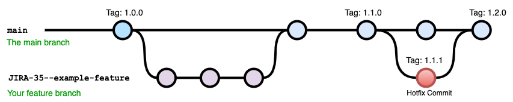
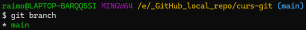
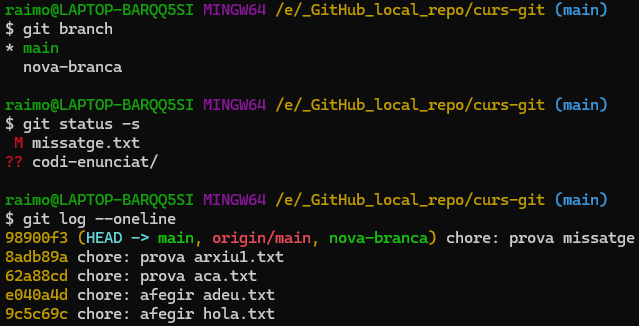
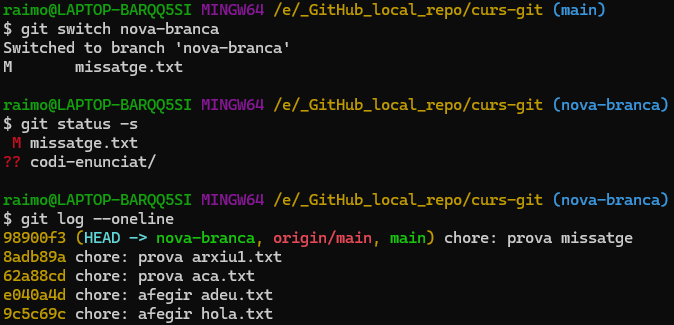
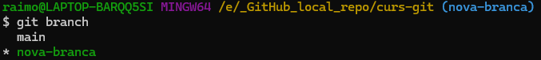

# Git Branch I
Ara ja sabem treballar amb unes quantes comandes de Git, però de moment només estem usant una capa inicial de les comandes existents.

Una de les aportacions més importants de la tecnologia Git és el conceptes de les **branques**.
## Definició

>[!IMPORTANT]
>En el context del versionat de codi, una *branch* és una **línia de desenvolupament independent** dins d'un repositori que permet **desenvolupar noves funcionalitats** o **corregir bugs** **sense afectar la branca principal** del projecte que conté la versió estable del producte.
>Al crear una nova branca, aquesta es bifurca de la branca actual i en copia el seu estat.
>Un cop fet, el desenvolupament de codi de la nova branca pot derivar cap a noves direccions ja que **cada branca té el seu historial de commits**.
>Això **permet treballar en equip** permetent **múltiples desenvolupaments simultanis** de la versió actual del codi del repositori.
>Si un cop acabat el codi d'una branca, es vol **integrar a la branca principal** del projecte des del quan es va bifurcar, es pot fusionar usant `git merge` per tal d'incorporar les noves funcionalitats dins del projecte final.



El nom de la **branca principal** que es crea per defecte al iniciar un repositori de Git és `main`.

Podem trobar repositoris que usen el nom `master` enlloc de `main`, però recentment la comunitat de desenvolupadors ha decidit abraçar el terme `main` per davant de `master` que podria semblar un llenguatge ofensiu per a algunes persones.

## Comprovar branques existents

>[!TIP]
>Podem ara doncs, comprovar quines branques tenim en el nostre repositori local:
>```bash
>git branch

Això ens mostrarà un resultat com el següent:


## Crear nova branca
Com hem vist, ens pot interessar crear una nova branca a partir d'una branca existent.
Aquest fet farà que es copiï tot el contingut de la branca des d'on estem creant la nova. Per tant és important tenir en compte a sobre de quina branca estem treballant abans de crear-ne una de nova.

>[!IMPORTANT]
>Per a crear una nova branca usarem la comanda:
>```bash
>git branch nova-branca

Aquesta acció crea una nova branca dins del nostre repositori heretant els fitxers en l'estat actual en què es troben dins de la branca en què estem treballant.

## Canviar d'una branca a l'altre

>[!IMPORTANT]
>Podem moure'ns entre branques de desenvolupament usant les comandes:
>```bash 
>git checkout nom-branca
>```
>O també la més actualitzada i recomanada:
>```bash
>git switch nom-branca
>```

## Crear una branca a partir de l'actual i moure'ns-hi
També podem anar un pas més enllà i crear una branca i al mateix temps apuntar cap a ella. És a dir unir la comanda `git branch nova-branca` + `git switch nova-branca`

>[!TIP]
>Això ho podem fer amb la comanda `git switch`amb el paràmetre `-c` de *'create'*:
>```bash
>git switch -c nova-branca
>```
>O altrenativament la versió més anticuada:
>```bash
>git checkout -b nova-branca
>```

## Exemple complet:


Aquí hem creat una nova branca sobre el contingut actual de master.

Ho podem comprovar observant l'històric de versions de cadascuna de les branques (`main` i `nova-branca`).

Aquí podem veure l'**estatus** i l'**històric** de versions de la branca `main`:


Aquí podem veure l'**estatus** i l'**històric** de versions de la branca `nova-branca`:
Tal i com podem veure en la captura anterior, hem usat `git switch nova-branca` per tal de moure'ns de la `main` a la `nova-branca`.

A més a més, ara que tenim dues branques, si usem la comanda `git branch` podrem veure les dues branques i sobre quina estem apuntant actualment:


## Canviar el nom d'una branca existent
>[!TIP]
>Si volem canviar el nom d'una branca existent on ara estem treballant, podem usar la comanda:
>```
>git branch -m nom-nou
>```
>Si ja existia una branca amb aquest nom, podem sobre-escriure-la:
>```
>git branch -M nom-nou
>```


