# Git Branch II
Ara que ja sabem crear i navegar entre branques, anem a utilitzar el seu propòsit principal: els **desenvolupaments simultanis**!
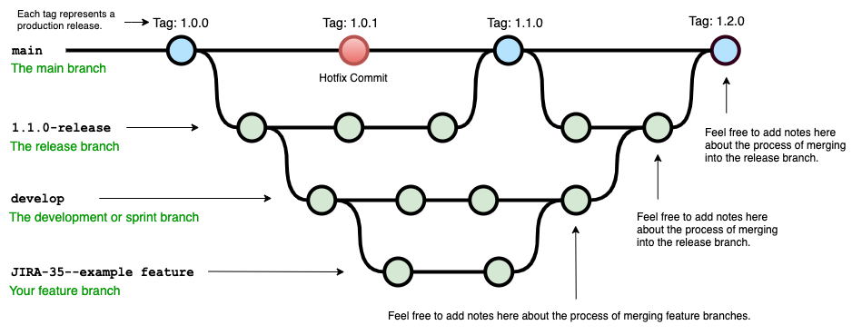

## Convenció de noms per les branques
Per a anomenar les branques seguirem la convenció següent:
- **`feature/`**: Per noves funcionalitats. Exemple: `feature/nova-funcionalitat`
- **`bugfix/`**: Per correccions d'errors. Exemple: `bugfix/arreglar-error-login`
- **`hotfix/`**: Per correccions urgents en producció. Exemple: `hotfix/correccio-critica`
- **`release/`**: Per preparar una nova versió de l'aplicació. Exemple: `release/2.0.0`
- **`chore/`**: Per tasques de manteniment i altres canvis no relacionats directament amb funcionalitats o errors. Exemple: `chore/actualitzar-dependencies`

### Recomanacions Addicionals
- **Evita Noms Massa Llargs**: Tot i que la descripció ha de ser clara, evita noms massa llargs per a les branques. Intenta mantenir-les precises i concises.
- **Utilitza Lletres Minúscules**: Generalment, és recomanable utilitzar lletres minúscules per mantenir la consistència i evitar problemes de compatibilitat amb sistemes de fitxers sensibles a majúscules i minúscules.
- **Estandarditza amb el teu Equip**: Assegura't que tot l'equip estigui d'acord amb la convenció de noms i la segueixi de manera consistent.

## Nivells de profunditat de branques
És habitual treballar fins a **tres nivells de profunditat** en projectes de mitjana a gran envergadura per tal d'ordenar, subdividir, separar i aïllar millor cadascun dels desenvolupaments que es troben en marxa. També pot ajudar a repartir-se millor la feina entre desenvolupadoris.

Per exemple:
```bash
main
 ├── feature/nova-funcionalitat
 │    ├── feature/nova-funcionalitat/sub-funcionalitat-1
 │    └── feature/nova-funcionalitat/sub-funcionalitat-2
 ├── bugfix
 │    ├── bugfix/login-error
 │    │    └── bugfix/login-error/fix-form
 │    └── bugfix/performance-issue
 └── release/1.0.0
```

## Fusionar branques
Quan el desenvolupament d'una branca ha acabat o conté ja una part important de codi estable que vol ser incorporat a la branca d'un nivell superior (per exemple pujar el codi de `bugfix/login-error/fix-form` cap a `bugfix/login-error`); hem de:
1. Dins de la branca que conté el codi que volem pujar, fer commit de tots els canvis que es vulguin pujar i assegurar-nos de que tot funciona correctament. En el cas de l'exemple, a la branca  `bugfix/login-error/fix-form`
2. Canviar a la branca de destí. En el cas de l'exemple anterior: `git switch bugfix/login-error`
3. Un cop ja estem situats a la branca de destí, executar la comanda `git merge nom-branca`. En el cas de l'exemple: `git merge bugfix/login-error/fix-form`
4. Estant encara en la branca de destí, executar `git commit` per tal de confirmar els canvis.

>[!TIP]
>Per tant, per a fusionar dues branques, ens mourem a la branca de destí i usarem la següent comanda:
>```shell
>git merge nom-sub-branca
>```
>
### Gestió de conflictes
En un món ideal, no tindriem cap problema al fer l'acció de fusionat entre branques de Git (`git merge`) i això significaria que tothom que ha estat treballant en el projecte ha desenvolupat línies de codi diferents a les dels altres companyis sense trepitjar-se la feina.

Malhauradament, en el món real, és habitual que apareguin conflictes i que aquests no permetin completar l'acció.

>[!IMPORTANT]
>Un conflicte en l'acció de fusionar branques en Git ocorre quan dues branques han fet canvis a les mateixes línies d'un fitxer o en àrees properes, i Git no pot fusionar automàticament aquests canvis. Cal resoldre manualment els conflictes per completar la fusió.

La gestió de conflictes pot arribar a ser complicada si no s'ha treballat de forma acurada, però sovint es poden resoldre fàcilment. Podem seguir els següents passos:
#### 1. Inici del Merge
Quan inicies un merge, Git intenta combinar automàticament els canvis de les dues branques. Si hi ha conflictes (canvis en les mateixes línies de codi o en àrees pròximes), Git t'ho notificarà.

#### 2. Identificació dels Conflictes
Després d'iniciar un merge, si hi ha conflictes, Git mostrarà un missatge similar a aquest:
```bash
Auto-merging fitxer1.txt
CONFLICT (content): Merge conflict in fitxer1.txt
Automatic merge failed; fix conflicts and then commit the result.
```
#### 3. Revisió dels Conflictes
Els fitxers amb conflictes tindran seccions especials que marquen les àrees conflictives. Les marques típiques són:

```plaintext
<<<<<<< HEAD
Canvis de la branca actual (HEAD)
=======
Canvis de la branca que s'està fusionant
>>>>>>> <nom-branca>
```

Per exemple:
```plaintext
<<<<<<< HEAD
Línia amb canvis de la branca actual
=======
Línia amb canvis de la branca que s'està fusionant
>>>>>>> feature/nova-funcionalitat
```

#### 4. Resolució dels Conflictes
Resol els conflictes manualment editant els fitxers afectats. Has de decidir com combinar els canvis de les dues branques de manera coherent.

#### Exemples de Resolució

1. **Mantenir només els canvis de la branca actual (HEAD)**:
   ```plaintext
   Línia amb canvis de la branca actual
   ```

2. **Mantenir només els canvis de la branca que s'està fusionant**:
   ```plaintext
   Línia amb canvis de la branca que s'està fusionant
   ```

3. **Combinar manualment els canvis de les dues branques**:
   ```plaintext
   Línia combinada de la branca actual i la que s'està fusionant
   ```

#### 5. Marca els Conflictes com Resolts
Després de resoldre els conflictes en els fitxers afectats, marca'ls com resolts amb `git add`:

```bash
git add fitxer1.txt
```

#### 6. Completa la Fusió
Després d'haver marcat tots els conflictes com resolts, completa la fusió amb un commit. Git crea automàticament un missatge de commit per a la fusió:

```bash
git commit
```

#### 7. Revisió i Confirmació
Revisa el commit de fusió per assegurar-te que tots els conflictes s'han resolt correctament i que el codi resultant és funcional.

Més endavant veurem com hi ha diverses eines que ens permetràn resoldre els conflictes amb una interfície gràfica de forma més amigable:
- **VS Code**: Té una integració de Git que mostra els conflictes i permet resoldre'ls gràficament.
- **Sourcetree**: Ofereix una interfície gràfica per gestionar conflictes.
- **KDiff3, Meld**: Eines específiques per a la fusió de codi i resolució de conflictes.

## Eliminar una branca existent
Utilitza la comanda `git branch -d` per a **eliminar una branca local** si ja ha estat fusionada amb la branca principal (`main` o `master`), o `git branch -D` per forçar l'eliminació d'una branca que encara no hagi estat fusionada.

Una branca funsionada és aquella a la qual se li ha fet un `git merge` a amb una altra branca per tal d'incorporar els canvis de codi que conté.

>[!IMPORTANT]
>Eliminar una branca fusionada:
>```bash
>git branch -d nom-branca
>```
>Forçar l'eliminació d'una branca no fusionada:
>```bash
>git branch -D nom-branca
>```

---

## Exemple treballant usant múltiples branques
Anem a crear el següent **diagrama de branques** en el nostre repositori:
```bash
main
 ├── feature/nova-funcionalitat
      ├── feature/nova-funcionalitat/sub-funcionalitat-1
      └── feature/nova-funcionalitat/sub-funcionalitat-2
```

### Creem la nova branca feature/nova-funcionalitat
`git switch -c feature/nova-funcionalitat`
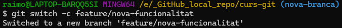
Crea la nova branca i ens mou cap a ella directament ja que usem el paràmentre `-c` de `git switch`
### Comprovem la nova branca
`git branch`
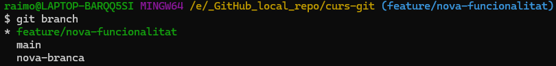

>[!TIP]
>A la consola del terminal de Git, podem observar sobre quina branca estem actualment (de color blau). En l'exemple <span style="color: royalblue;">(feature/nova-funcionalitat)</span>.
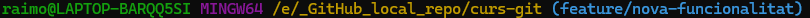
### Creem la branca sub-funcionalitat-1
`git switch -c sub-funcionalitat-1`
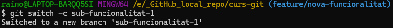
### Comprovem estat del versionat dins de la nova branca `sub-funcionalitat-1`:
`git status -s`
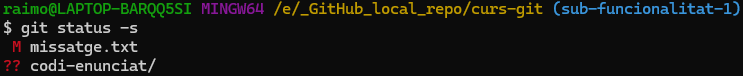
### Fem commit del fitxer missatge.txt
`git add missatge.txt`
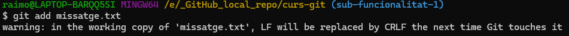

>[!WARNING]
>El missatge `warning: in the working copy of 'missatge.txt', LF will be replaced by CRLF the next time Git touches it` és degut a que aquestes captures de pantalla s'han generat en un entorn Windows i els caràcters imprimibles que s'usen per determinar el final de línia són: `CR` (Carriage Return, ASCII 13) i `LF` (Line Feed, ASCII 10); també els podem veure representats com a `\r` i `\n` respectivament. 
>En canvi els sistemes Unix-like només usen `LF` per a especificar el final de línia en els fitxers de text pla. Git per defecte usa la sintaxi de Unix, però en entorns Windows, en funció de quines opcions de configuració haguem escollit al instal·lar Git, pot usar la convenció de Windows.

`git commit -m "chore: add missatge.txt`
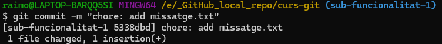

### Comprovem històric de versionat de la sub-branca
`git log --oneline`
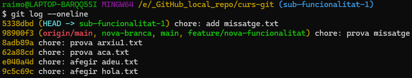

### Comprovem històric de versionat de la branca superior
Actualment estem a la branca `feature/nova-funcionalitat/sub-funcionalitat-1`.

1. Comprovem branques existents dins del repositori `git branch`:
	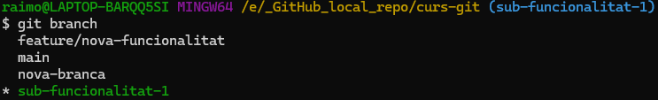
2. Canviem de branca `git switch feature/nova-funcionalitat`:
	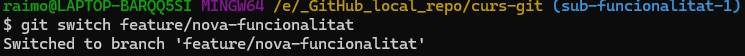
3. Comprovem històric de versionat `git log --oneline:
	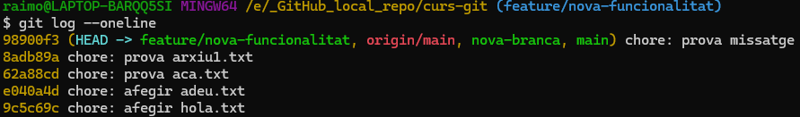

Tal i com podem veure, la branca `feature/nova-funcionalitat/sub-funcionalitat-1` va un commit (5338dbd) per davant de la branca `feature/nova-funcionalitat` que va pel commit (98900f3).

### Fusionem les dues sub-branques
Estant apuntant a la branca `feature/nova-funcionalitat`, executarem `git merge sub-funcionalitat-1`.

Com que no hi havia cap conflicte de contingut a cap fitxer entre les versions de codi confirmades de les dues branques, hem pogut fer el fusionat exitosament.

### Comprovem l'històric de versions després del fusionat
Ara esperaríem que l'històric de vesions de les dues sub-branques sigui igual.
Estant encara dins de la branca `feature/nova-funcionalitat`, usan `git log --oneline` podem veure:
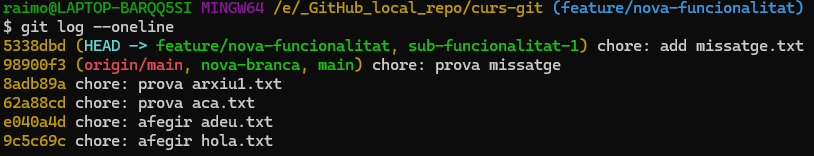
>[!TIP]
>El resultat que ens ofereix la comanda `git log --oneline`, ens aporta l'històric dels commits del versionat del codi de més nou a més antic sent l'últim commit el primer que es va fer (a l'exemple: 9c5c69c).
>Però també ens informa de més coses:
>1. En quin commit es troba cada branca del repositori. Ara mateix les branques `origin/main` *(en parlem a sota)*, `nova-branca` i `main` es troben desactualitzades en un commit anterior (98900f3) al més recent (5338dbd) on sí que hi trobem les branques que hem estat modificant a l'exemple.
>2. També podem veure a quin commit es troba el repositori en la versió remota `origin/main` *(ja en parlarem quan veiem GitHub)*.
>3. També podem veure la paraula clau `HEAD` que ens indica sobre quina branca estem treballant o altrament dit, quina és la branca activa.

### Provoquem un conflicte al fusionar a la branca main
Ens mourem a la branca principal del projecte: `main` i allà **modificarem** i **confirmarem** el mateix fitxer `missatge.txt` per tal de tenir **dues versions diferents del fitxer** en dues branques diferents i en l'**acció de fusionat** entre `main` i la sub-branca `nova-funcionalitat` sorgeixi un **conflicte**.

També veurem que **mentre una sub-branca** té **canvis confirmats pendents** de ser **fusionats**, **no pot ser eliminada** automàticament.

1. Ens mourem a la branca principal del projecte: `main`.	
2. Intentem eliminar la sub-branca `feature/nova-funcionalitat`, però no ens deixarà ja que té canvis confirmats que no han estat fusionats a cap altra branca i, per tant, es perdrien:
	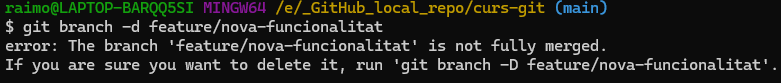
3. Comprovem estat del versionat del nostre repo local des de la branca `main`:
	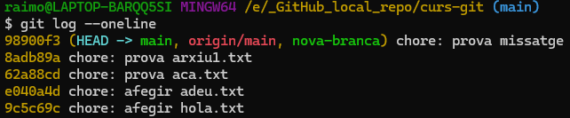
4. Comprovem estat del versionat des de la branca `nova-funcionalitat`:
	
5. Des de la branca `main`, modifiquem l'arxiu `missatge.txt`:
	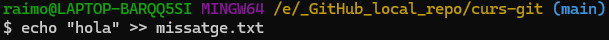
5. Afegim i confirmem el fitxer `missatge.txt` amb els canvis a la branca `main`:
	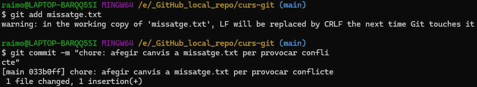
6. Comprovem el contingut del fitxer `missatge.txt` dins de la branca `main`:	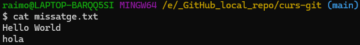
7.  Comprovem el contingut del fitxer `missatge.txt` dins de la branca `feature/nova-funcioanlitat`:	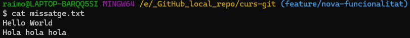
8. Des de la branca `main` intentem fer merge amb la branca `feature/nova-funcionalitat`:	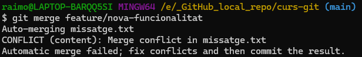
	Tal i com podem veure, tenim un conflicte al fer merge degut a les **diferents versions de contingut** de l'arxiu `missatge.txt`.
9. Si ara explorem el contingut de l'arxiu `missatge.txt`, podrem veure el següent:
	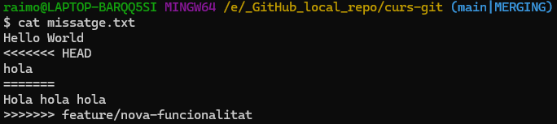
	El contingut de la primera línia del document: `"Hello World"`; és comuna entre les versions confirmades del document `missatge.txt` de cada branca.
	
	Però a partir de la marca `<<<<<<< HEAD` ens indica el contingut confirmat `"hola"` dins de la branca de destí (en aquest cas `main`) versus el contingut confirmat `"Hola hola hola"` de la branca que volem fusionar (en aquest cas `feature/nova-funcionalitat`).
	
	El conjunt de caràcters `=======` serveix per a separar el cotingut confirmat del document a cadascuna de les dues branques.

	Hem de **resoldre el conflicte** i, amb un **editor de text**, **eliminar** aquestes **marques especials** i **decidir quin contingut és el correcte** pel fitxer. Per exemple podem decidir quedar-nos amb només el codi del `main` o només amb el codi de `feature/nova-funcionalitat` o manualment fer un *collage* entre les dues versions.
	
10. Un cop fet, hem de confirmar els canvis amb un `git add missatge.txt` i `git commit -m "missatge"`.
Alternativament amb un `git commit -am "missatge"`.

	

	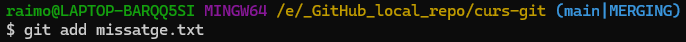

	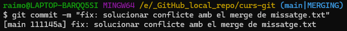

	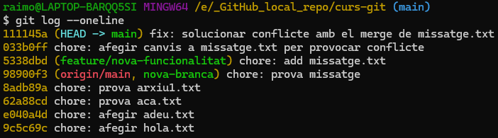

>[!NOTE]
>Quan tenim un merge a mitges degut a un conflicte, primer l'hem de resoldre i després de fer-ne un add i commit, és possible que necessitem executar la comanda `git merge --continue`

>[!IMPORTANT]
>Fixe'm nos que durant la fase de resolució de conflictes del `git metge` ha provocat que ara el repositori estigui apuntant a un estat temporal: <span style="color: royalblue;">(main|MERGING)</span>

11. Ara, a la branca `feature/nova-funcionalitat` hi ha una versió més antiga del contingut del fitxer `missatge.txt` i, com que ja l'hem fusionat, podriem eliminar aquesta branca usant `git branch -d feature/nova-funcionalitat`.

	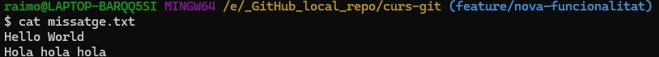
	
	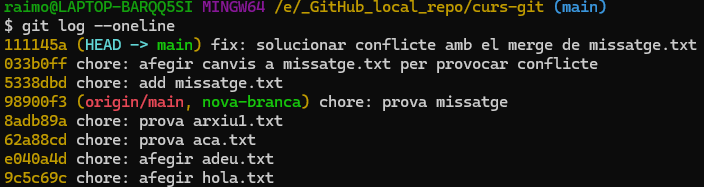

---

# Consultar i descarregar branques remotes
Si tenim el repo local sincronitzat a GitHub i volem consultar les branques remotes, podem usar la comanda `git branch -r` per veure només les branques remotes o `git branch -a` per veure-les totes.

Aleshores, podem descarregar-nos una branca del remot que no tenim al local: `git checkout nom-branca-remota`

# Pujar una branca local al remot
Per pujar una branca local al remot: `git push -u origin nom-branca`

Això pujarà la branca local al remot. El paràmetre `-u` siginifica *upstream* i la paraula *origin* es refereix al remot.
