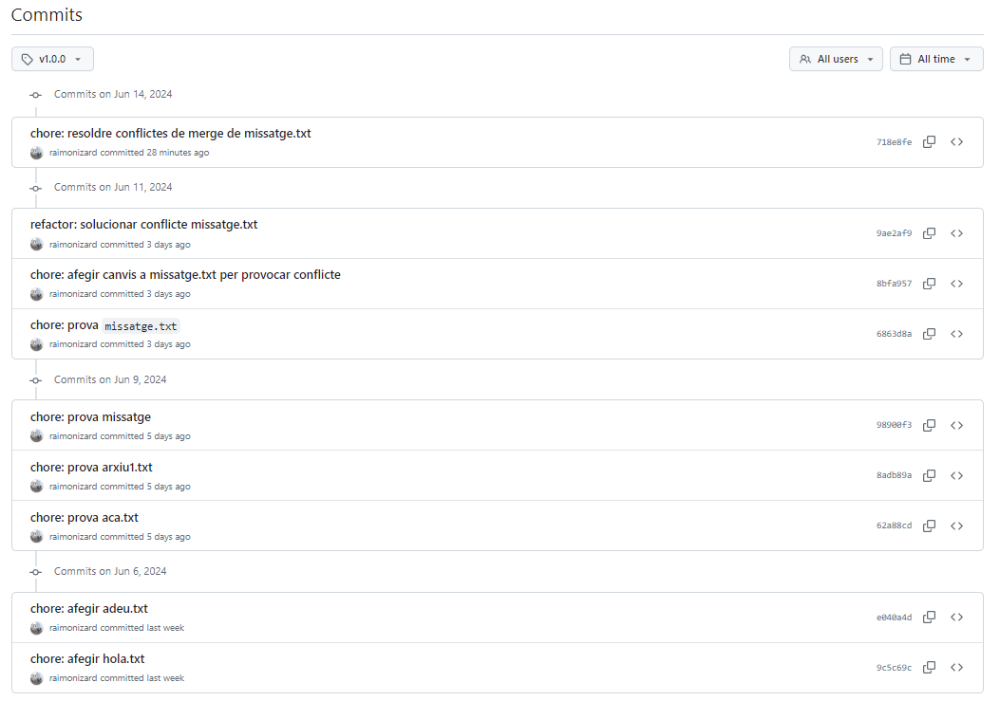

# Git tags i GitHub releases
## Git tags
En Git s'utilitzen el tags per **marcar punts específics a l'historial** del projecte; com per exemple versions de llançament (v1.0.0, v2.0.0, etc.).

Són **etiquetes** que **pots aplicar** a un **commit** per identificar-lo més fàcilment en el futur. Hi ha dos tipus principals de tags:

1. **Tags Anotats**: Contenen informació addicional com el **nom del creador** del tag, la data, i un missatge. Són ideals per a **versions oficials**.

2. **Tags Lleugers**: Són essencialment com a branques que no canvien i només apunten a un commit específic sense informació addicional.

### Crear un tag anotat:
```sh
git tag -a v1.0.0 -m "docs: versió 1.0.0"
git push origin v1.0.0
```

### Crear un tag lleuger:
```sh
git tag v1.0.0
git push origin v1.0.0
```

## GitHub releases

Les **releases no formen part del cor de Git** i són **específiques** de la plataforma **GitHub**. Són una funcionalitat que **utilitza tags** per **crear versions formals** del teu projecte. Són un pas més enllà dels tags de Git.

Les releases **proporcionen un conjunt de fitxers** que **es poden descarregar** *(normalment en formats ZIP o tarball)* i una interfície gràfica per gestionar versions.

### Beneficis de les releases:
- **Distribució de codi:** Permet als usuaris descarregar una versió específica del teu projecte en forma d'arxius preconstruïts.
- **Històric de versions:** Manté un registre clar de les versions del teu projecte, incloent canvis, notes de versió, i fitxers binaris associats.
- **Notes de versió (changelog):** Pots proporcionar informació detallada sobre què s'ha canviat, corregit o afegit en cada versió. Això ajuda els usuaris a comprendre les millores i canvis en el projecte.

### Crear una release a GitHub:
1. **Anar al repositori del projecte a GitHub.**
2. **Fer clic a "Releases" a la part dreta del menú.**
3. **Fer clic a "Draft a new release".**
4. **Seleccionar un tag existent o crear-ne un de nou.**
5. **Omplir els camps de títol i notes de la versió.**
6. **Afegir arxius binaris o d'altres fitxers si és necessari.**
7. **Fer clic a "Publish release".**

### Exemple del changelog resultant de la publicació d'una release:



